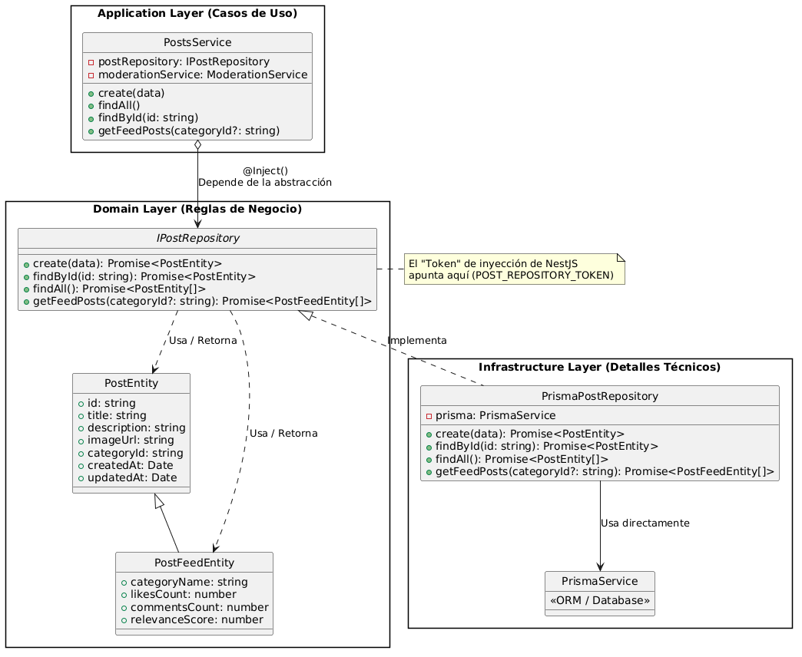
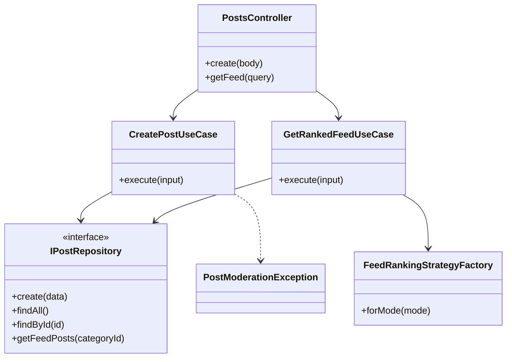

# Reporte de Proyecto: Identificación de Problemas y Soluciones

Este documento detalla el análisis del sistema, los problemas de diseño o implementación identificados en la arquitectura inicial y las soluciones técnicas aplicadas para resolverlos.

<p align="center">
  
</p>


## Problemas Identificados / Solución Implementada

En esta sección se describen las deficiencias, bugs o limitaciones técnicas encontradas en el sistema original.

### ❗️ Problema 1:  Violación de Inversión de Dependencias (Acoplamiento al ORM)
* **Descripción:** La capa de logica de negocio de (`PostsService`) inyectaba y dependia directamente de la clase concreta `PrismaService`, utilizando comandos especificos de el motor Prisma para acceder a los datos.
* **Impacto:** Generaba un alto acoplamiento tecnologico. Hacia imposible que si en dado caso se tuviese que remplazar Prisma por otro ORM en el futuro, seria ciertamente imposible no tener que reescribir toda la logica de negocio y donde por otro lado, dificultaba la creacion de tests unitarios aislados.

### 🛠 Solución implementada:
* **Estrategia:** Se implemento el Patron Repositorio. Se creo una abstraccion en (`IPostRepository`) y entidades puras en el Domain. Toda la logica que poseia Prisma se movio a una clase de Infraestructura (`PrismaPostRepository`). Finalmente el `PostsService` paso a depender unicamente de la interfaz mediante la tecnica de Inyeccion de Dependencias.
* **Justificación:** Al aislar los detalles de infraestructura detras de un "contrato" (la interfaz), la aplicacion y la logica de negocio queda protegida de cambios externos y el codigo se vuelve altamente testeable al no depender fuertemente de Prisma.

<!--Aqui el diagrama de clases y/o codigo resumido de apoyo.-->
<!--Se recomienda usar PlantUML para los diagramas, aunque otros formatos son aceptados igual.-->
<p align="center">
  
</p>


---
### ❗️ Problema 2: Lógica de negocio acoplada a NestJS y HTTP

* **Descripción:** La lógica de creación de publicaciones estaba mezclada con detalles propios del framework NestJS. En particular, `PostsService` lanzaba directamente `BadRequestException` cuando una publicación era rechazada por moderación. Además, el método `create` recibía directamente `CreatePostDto`, que pertenece a la capa de presentación.

* **Impacto:** Esto generaba acoplamiento entre la lógica de negocio y HTTP. Si se quisiera reutilizar esta lógica fuera de un controlador REST, por ejemplo en tests unitarios, jobs internos o WebSockets, seguiría dependiendo de excepciones propias de NestJS. También dificultaba probar la regla de negocio de moderación de forma aislada.

### 🛠 Solución implementada:

* **Estrategia:** Se creó una excepción propia del dominio llamada `PostModerationException` y se movió la lógica de creación de publicaciones a `CreatePostUseCase`. El caso de uso ejecuta la moderación y, si el contenido es rechazado, lanza una excepción de dominio. Luego, el controlador se encarga de traducir esa excepción a una respuesta HTTP mediante `BadRequestException`.

* **Justificación:** Con este cambio, la capa de aplicación expresa reglas del negocio sin depender directamente de HTTP. La traducción a códigos de estado queda en la capa de presentación, respetando la separación de responsabilidades propuesta por Clean Architecture.

```ts
export class PostModerationException extends Error {
    constructor(message = "Post bloqueado por moderación") {
        super(message)
        this.name = "PostModerationException"
    }
}
```

```ts
if (!moderation.approved) {
    throw new PostModerationException(
        moderation.reason ?? "Post bloqueado por moderación",
    )
}
```


---
...
### ❗️ Problema 3: `PostsService` con demasiadas responsabilidades

* **Descripción:** `PostsService` concentraba múltiples operaciones: crear publicaciones, listar publicaciones, buscar por ID y obtener los datos del feed. Además, el controlador de posts contenía lógica de aplicación al obtener los posts del feed y aplicar directamente una estrategia de ranking.

* **Impacto:** Esta estructura rompía el principio de responsabilidad única, ya que una misma clase podía cambiar por muchos motivos distintos. También hacía que el controlador dejara de ser una capa delgada, porque no solo recibía la petición HTTP, sino que también participaba en la orquestación del caso de uso del feed.

### 🛠 Solución implementada:

* **Estrategia:** Se separó la lógica en casos de uso específicos. `CreatePostUseCase` quedó encargado de crear publicaciones y validar moderación, mientras que `GetRankedFeedUseCase` quedó encargado de obtener los posts del feed y aplicar el ranking correspondiente mediante `FeedRankingStrategyFactory`.

* **Justificación:** Al dividir la lógica en casos de uso, cada clase tiene una responsabilidad clara. El controlador queda limitado a recibir parámetros, llamar al caso de uso correspondiente y devolver la respuesta. Esto mejora la mantenibilidad, facilita las pruebas y acerca el servidor a Clean Architecture.

```ts
async getFeed(@Query() query: FeedQueryDto) {
    return this.getRankedFeedUseCase.execute({
        categoryId: query.categoryId,
        mode: query.mode,
    })
}
```

```ts
async execute(input: GetRankedFeedInput) {
    const mode = input.mode ?? "latest"
    const feedPosts = await this.postRepository.getFeedPosts(input.categoryId)
    const rankedPosts = this.feedRankingFactory.forMode(mode).rank(feedPosts)

    return {
        mode,
        count: rankedPosts.length,
        rows: rankedPosts,
    }
}
```

---

## Diagrama de clases resumido de la refactorización


---

### ❗️ Problema 4: Lógica de aplicación dentro del controlador

* **Descripción:** El controlador de publicaciones contenía lógica de aplicación al construir el feed. En lugar de limitarse a recibir la petición HTTP y delegar el trabajo, `PostsController` obtenía los posts mediante el servicio y luego aplicaba directamente la estrategia de ranking usando `FeedRankingStrategyFactory`.

* **Impacto:** Esto provocaba que la capa de presentación tuviera responsabilidades que no le correspondían. El controlador quedaba acoplado a reglas de aplicación, dificultando la mantención, las pruebas y la reutilización de la lógica del feed en otros contextos distintos a HTTP.

### 🛠 Solución implementada:

* **Estrategia:** Se creó el caso de uso `GetRankedFeedUseCase`, encargado de obtener los posts del feed y aplicar el ranking correspondiente. El controlador ahora solo recibe los parámetros de la request y delega la operación al caso de uso.

* **Justificación:** Al mover la orquestación del feed a la capa de aplicación, el controlador queda como una capa delgada. Esto respeta Clean Architecture, ya que la presentación no debería contener reglas de negocio ni coordinación de procesos internos.

#### Código resumido

Antes, el controlador hacía la orquestación:

```ts
const mode = query.mode ?? "latest"
const feedPosts = await this.postsService.getFeedPosts(query.categoryId)
const rankedPosts = this.feedRankingFactory.forMode(mode).rank(feedPosts)
```

Después, el controlador solo delega:

```ts
@Get("feed")
async getFeed(@Query() query: FeedQueryDto) {
    return this.getRankedFeedUseCase.execute({
        categoryId: query.categoryId,
        mode: query.mode,
    })
}
```

El caso de uso concentra la lógica de aplicación:

```ts
async execute(input: GetRankedFeedInput) {
    const mode = input.mode ?? "latest"
    const feedPosts = await this.postRepository.getFeedPosts(input.categoryId)
    const rankedPosts = this.feedRankingFactory.forMode(mode).rank(feedPosts)

    return {
        mode,
        count: rankedPosts.length,
        rows: rankedPosts,
    }
}
```

---

### ❗️ Problema 5: Uso directo de DTOs y modelo de dominio anémico

* **Descripción:** La lógica de negocio recibía directamente `CreatePostDto`, una clase perteneciente a la capa de presentación. Además, los datos obtenidos desde Prisma eran usados como objetos de aplicación sin pasar claramente por entidades de dominio propias.

* **Impacto:** Esto mezclaba responsabilidades entre capas. Los DTOs están pensados para validar y transportar datos desde HTTP, no para representar reglas o estructuras internas del dominio. Además, depender directamente de los objetos generados por Prisma hacía que la lógica de negocio quedara más acoplada a detalles de infraestructura.

### 🛠 Solución implementada:

* **Estrategia:** Se separó la entrada HTTP del caso de uso mediante un tipo propio `CreatePostInput`. Además, se incorporaron entidades de dominio como `PostEntity` y `PostFeedEntity`, utilizadas por el repositorio para devolver estructuras propias del dominio en vez de objetos crudos de Prisma.

* **Justificación:** Esta separación permite que los casos de uso no dependan directamente de DTOs ni de modelos generados por el ORM. Con esto, la lógica de aplicación queda más limpia, más fácil de probar y menos dependiente de detalles externos.

#### Código resumido

El DTO queda en la capa de presentación:

```ts
@Post()
async create(@Body() body: CreatePostDto) {
    const created = await this.createPostUseCase.execute({
        title: body.title,
        description: body.description,
        imageUrl: body.imageUrl,
        categoryId: body.categoryId,
    })

    return {
        ok: true,
        payload: created,
    }
}
```

El caso de uso recibe una estructura propia:

```ts
type CreatePostInput = {
    title: string
    description: string
    imageUrl: string
    categoryId?: string
}
```

El repositorio retorna entidades de dominio:

```ts
return new PostEntity({
    id: post.id,
    title: post.title,
    description: post.description,
    imageUrl: post.imageUrl,
    categoryId: post.categoryId,
    createdAt: post.createdAt,
    updatedAt: post.updatedAt,
})
```

---

## Diagrama resumido de los problemas 4 y 5

```mermaid
classDiagram
    class PostsController {
        +create(body)
        +getFeed(query)
    }

    class CreatePostDto {
        +title
        +description
        +imageUrl
        +categoryId
    }

    class CreatePostUseCase {
        +execute(input)
    }

    class GetRankedFeedUseCase {
        +execute(input)
    }

    class IPostRepository {
        <<interface>>
        +create(data)
        +getFeedPosts(categoryId)
    }

    class PrismaPostRepository {
        +create(data)
        +getFeedPosts(categoryId)
    }

    class PostEntity {
        +id
        +title
        +description
        +imageUrl
        +categoryId
        +createdAt
        +updatedAt
    }

    class PostFeedEntity {
        +categoryName
        +likesCount
        +commentsCount
        +relevanceScore
    }

    class FeedRankingStrategyFactory {
        +forMode(mode)
    }

    PostsController --> CreatePostDto
    PostsController --> CreatePostUseCase
    PostsController --> GetRankedFeedUseCase
    CreatePostUseCase --> IPostRepository
    GetRankedFeedUseCase --> IPostRepository
    GetRankedFeedUseCase --> FeedRankingStrategyFactory
    PrismaPostRepository ..|> IPostRepository
    PrismaPostRepository --> PostEntity
    PrismaPostRepository --> PostFeedEntity
    PostFeedEntity --|> PostEntity
